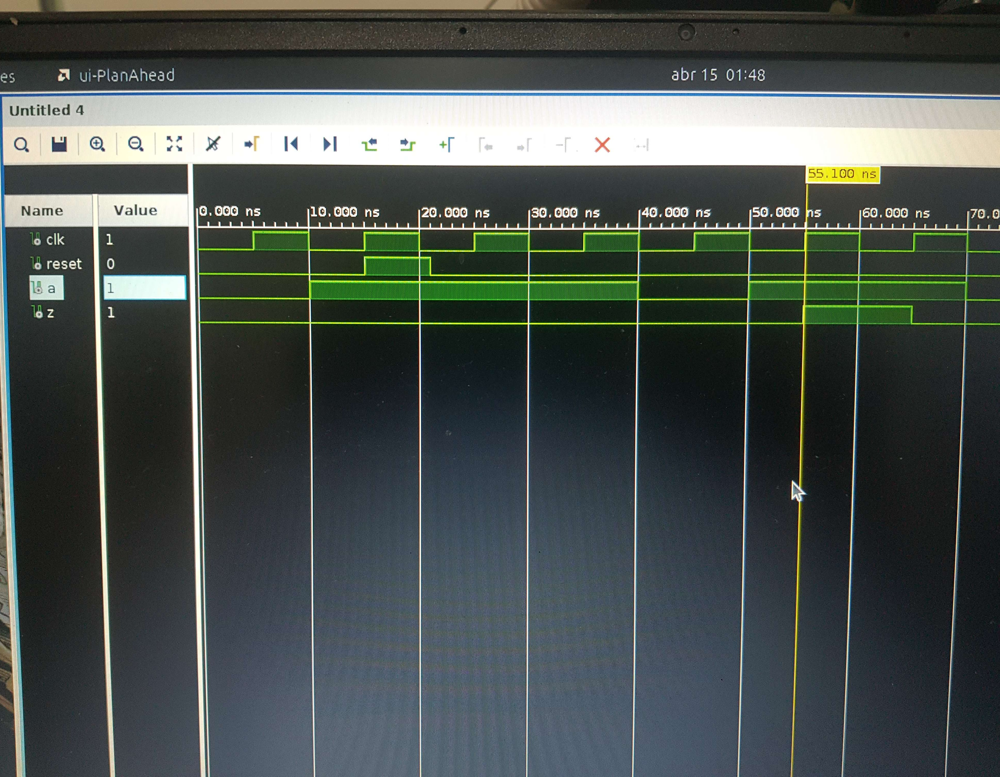

# FSM 11011

O código-fonte para o módulo da FSM é `fsm_11011.vhd`.

O código do testbench para validação é `fsm_11011_tb.vhd`

Abaixo está uma foto da simulação no testbench, em que inicialmente se dá um `reset`. Enquanto isso, a entrada `a` permanece ativa por 3 ciclos de clock, até que é desligada por um ciclo e ligada novamente por dois ciclos, ativando a saída `z`.

